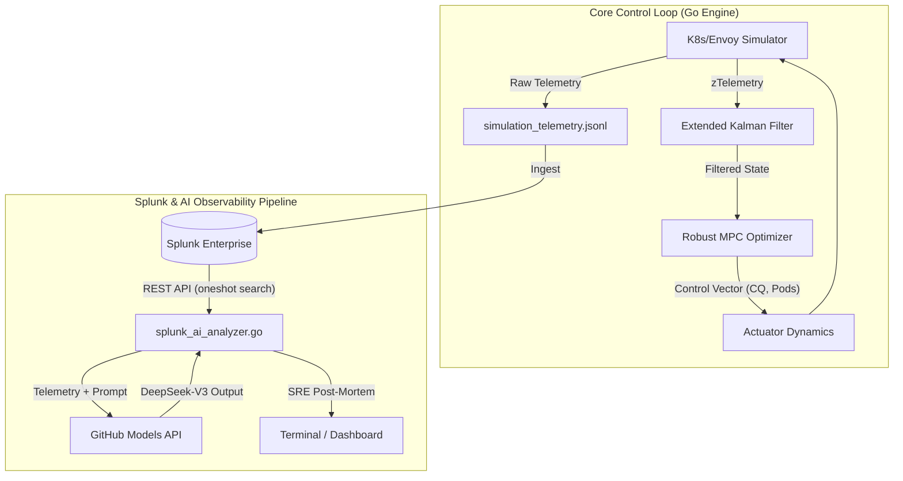

# Autonomous SRE: Splunk Hackathon Control Engine & AI Post-Mortem

This repository contains an aerospace-grade, mathematically rigorous control theory engine (Model Predictive Control + Extended Kalman Filter). It is designed to autonomously manage Kubernetes/Envoy distributed systems during catastrophic failures. 

It integrates natively with **Splunk Enterprise** for operational observability and uses **GitHub Models (DeepSeek-V3)** for automated, AI-driven Incident Root Cause Analysis.

## 🏗 Architecture & Data Flow

🚀 Key Capabilities

Zero-Allocation Hot Path: Evaluates 750M+ Stochastic Differential Equations (SDEs) across CPU cores without heap allocation.

Universal Scalability Law (USL): Mathematically prevents infinite over-scaling during database lockups.

Byzantine Fault Shield: The EKF automatically rejects NaN/Inf sensor poisoning and flies on mathematical instruments until telemetry heals.

Autonomous AI Analyst: Fetches live search results from Splunk and pages DeepSeek-V3 to generate instant Root Cause Analyses.

📂 Repository Structure
Plaintext
.
├── .env                        # Environment variables (Splunk/GitHub API Keys)
├── .gitignore
├── go.mod
├── go.sum
├── main.go                     # Entry point for AI Analyzer
├── README.md                   # Project documentation & Architecture
├── splunk_ai_analyzer.go       # Splunk REST API & DeepSeek-V3 integration
└── control/                    # Core Physics & Math Engine
    ├── actuator_dynamics.go    # Envoy & K8s physical limits
    ├── adversarial_physics_test.go # Actuator failure & resonance tests
    ├── bundle_generator.go
    ├── chaos_simulation_test.go# Main simulation (Outputs JSON Telemetry)
    ├── compact.go
    ├── coordinated_optimizer.go# Zero-allocation MPC
    ├── doc.go
    ├── ekf_robustness_test.go  # Byzantine fault & NaN injection tests
    ├── forecast.go
    ├── horizon_cost.go
    ├── incident_analyzer.go    # Local JSON AI analyzer
    ├── kalman.go               # 9D Extended Kalman Filter
    ├── matrix55.go
    ├── memory_leak_test.go     # GC & Zero-allocation verification
    ├── parameter_estimator.go
    ├── policy_controller.go    # Control loop & SLA constraints
    ├── regime_memory.go        # Risk EWMA tracking
    ├── simulation_test.go
    ├── state_matrix.go
    ├── state_space.go          # Telemetry mapping
    ├── state_transition.go     # Physics SDE equations
    └── system_identification.go
🛠 Prerequisites & Setup
Clone the Repository

Bash
git clone [https://github.com/kuldeep-poonia/splunk_hackathone.git](https://github.com/kuldeep-poonia/splunk_hackathone.git)
cd splunk_hackathone
Install Dependencies

Bash
go get [github.com/joho/godotenv](https://github.com/joho/godotenv)
go mod tidy
Configure Environment Variables
Create a .env file in the root directory:

Code snippet
# Splunk Configuration
SPLUNK_URL=https://localhost:8089
SPLUNK_USER=admin
SPLUNK_PASSWORD=your_secure_password

# GitHub Models API Configuration
GITHUB_TOKEN=github_pat_11AXXXXX_YYYYYY
🏃‍♂️ Running the System
1. Generate Telemetry (Run the Physics Simulation)
Simulate a Flash Crowd, Network Partition, and Node Death. This generates the simulation_telemetry.json dataset.

Bash
go test -v -run TestChaos_CascadingDeathSpiral ./control/...
2. Validate Mathematical Safety (Monte Carlo CVaR)
Run 10,000 parallel universe simulations to mathematically prove the 95% Tail Risk bounds.

Bash
go test -v -run TestChaos_MonteCarlo_10000_Scenarios ./control/...
3. Run the Splunk AI Post-Mortem
Ensure your Splunk instance is running and has ingested the telemetry. Then execute the AI analyzer:

Bash
go run main.go
📄 License
This project is licensed under the MIT License.

Plaintext
MIT License

Copyright (c) 2026 Kuldeep Poonia

Permission is hereby granted, free of charge, to any person obtaining a copy
of this software and associated documentation files (the "Software"), to deal
in the Software without restriction, including without limitation the rights
to use, copy, modify, merge, publish, distribute, sublicense, and/or sell
copies of the Software, and to permit persons to whom the Software is
furnished to do so, subject to the following conditions:

The above copyright notice and this permission notice shall be included in all
copies or substantial portions of the Software.

THE SOFTWARE IS PROVIDED "AS IS", WITHOUT WARRANTY OF ANY KIND, EXPRESS OR
IMPLIED, INCLUDING BUT NOT LIMITED TO THE WARRANTIES OF MERCHANTABILITY,
FITNESS FOR A PARTICULAR PURPOSE AND NONINFRINGEMENT. IN NO EVENT SHALL THE
AUTHORS OR COPYRIGHT HOLDERS BE LIABLE FOR ANY CLAIM, DAMAGES OR OTHER
LIABILITY, WHETHER IN AN ACTION OF CONTRACT, TORT OR OTHERWISE, ARISING FROM,
OUT OF OR IN CONNECTION WITH THE SOFTWARE OR THE USE OR OTHER DEALINGS IN THE
SOFTWARE.