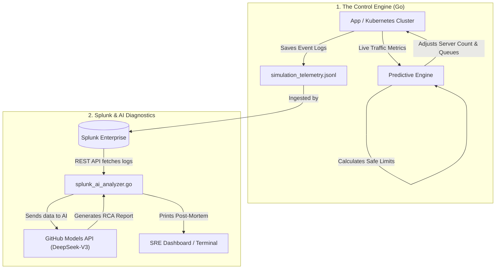

Markdown
# Autonomous SRE: Smart Cloud Autopilot & AI Post-Mortem

Welcome to the **Autonomous SRE** project! This is a smart control system designed to keep web applications and cloud infrastructure running smoothly during massive traffic spikes or unexpected server failures. It also automates the boring part of an engineer's job: figuring out what went wrong after a crash.

Built for the **Splunk Hackathon**, this project combines Predictive Math, Splunk Enterprise, and Artificial Intelligence to create a self-healing and self-reporting system.

---

## 🛑 The Problem: Why did we build this?

1. **The "Traffic Spike" Crash:** When a website gets a sudden surge of users (like during a flash sale), traditional auto-scalers just keep adding more servers. This often overwhelms the main database, causing a complete system blackout.
2. **Broken Dashboards:** If the monitoring tools break and report fake data (like negative traffic), auto-scalers panic and make wrong decisions.
3. **The Midnight Debugging:** When a system crashes, Site Reliability Engineers (SREs) have to manually dig through thousands of logs to find the root cause, which takes hours.

## 💡 The Solution: How it works

This project replaces reactive auto-scaling with a **Predictive Autopilot**. 

* **Traffic Control (The Bouncer):** Instead of blindly adding servers, it calculates exactly how much traffic your backend can handle. If the database is struggling, it acts like a bouncer—temporarily holding requests in a queue (using Envoy Proxy) so the system doesn't crash. 
* **Sensor Shield:** If monitoring tools send garbage data, the engine ignores it and safely "flies on instruments" using its own estimates until the sensors are fixed.
* **Splunk + AI Post-Mortems:** The moment an incident is resolved, our tool automatically fetches the incident logs from **Splunk** and sends them to an AI model (**DeepSeek-V3**). The AI instantly writes a clear, human-readable report explaining what broke and how to prevent it next time.

---

## 🏗 Architecture & Data Flow

Here is how the data moves through the system, from the application to the AI report:

📂 Project Structure
Here is a breakdown of the code inside this repository:

Plaintext
.
├── .env                        # API keys and Passwords (Ignored by Git)
├── .gitignore                  
├── go.mod / go.sum             # Go dependencies
├── main.go                     # The main file to run the AI incident analyzer
├── README.md                   # This file
├── splunk_ai_analyzer.go       # Connects to Splunk, fetches logs, and talks to AI
└── control/                    # The brain of the project (Physics & Math Engine)
    ├── actuator_dynamics.go    # Simulates Kubernetes scaling and Envoy queues
    ├── adversarial_physics_test.go # Tests to ensure the system survives bad data
    ├── bundle_generator.go     # Generates possible solutions for the current problem
    ├── chaos_simulation_test.go# Runs fake disasters to test the engine (Outputs JSON)
    ├── coordinated_optimizer.go# Picks the best, cheapest solution to keep the app alive
    ├── ekf_robustness_test.go  # Tests the "Sensor Shield" against fake data
    ├── incident_analyzer.go    # Local version of the AI analyzer
    ├── kalman.go               # The filter that smooths out messy traffic data
    ├── policy_controller.go    # Enforces rules (like "Keep latency under 0.1s")
    ├── state_transition.go     # Mathematical formulas simulating the server
    └── ... (other utility files)

🛠 Setup & Installation
Prerequisites
Go (Version 1.21 or higher)

Splunk Enterprise (Running locally or in the cloud)

GitHub Personal Access Token (To access the DeepSeek-V3 AI model)

1. Clone the Code
Bash
git clone [https://github.com/kuldeep-poonia/splunk_hackathone.git](https://github.com/kuldeep-poonia/splunk_hackathone.git)
cd splunk_hackathone
2. Install Dependencies
Bash
go get [github.com/joho/godotenv](https://github.com/joho/godotenv)
go mod tidy
3. Setup Environment Variables
Create a file named .env in the main folder and add your credentials:

Code snippet
# Your Splunk Login Details
SPLUNK_URL=https://localhost:8089
SPLUNK_USER=admin
SPLUNK_PASSWORD=your_splunk_password

# GitHub Token for AI Access
GITHUB_TOKEN=github_pat_your_token_here
🏃‍♂️ How to Run
Step 1: Run the Chaos Simulation (Create Data)
To see the engine in action, we need to run a simulation where we hit the system with a massive traffic spike and a server failure. This will generate a log file (simulation_telemetry.json).

Bash
go test -v -run TestChaos_CascadingDeathSpiral ./control/...
Step 2: Upload to Splunk
Make sure Splunk is monitoring the folder where simulation_telemetry.jsonl is saved, so it ingests the logs.

Step 3: Run the AI Incident Analyzer
Once Splunk has the logs, run this command. The script will securely log into Splunk, grab the latest crash data, send it to the AI, and print a human-readable root cause analysis.

Bash
go run main.go
📄 License
This project is licensed under the MIT License. Feel free to use, modify, and distribute it!